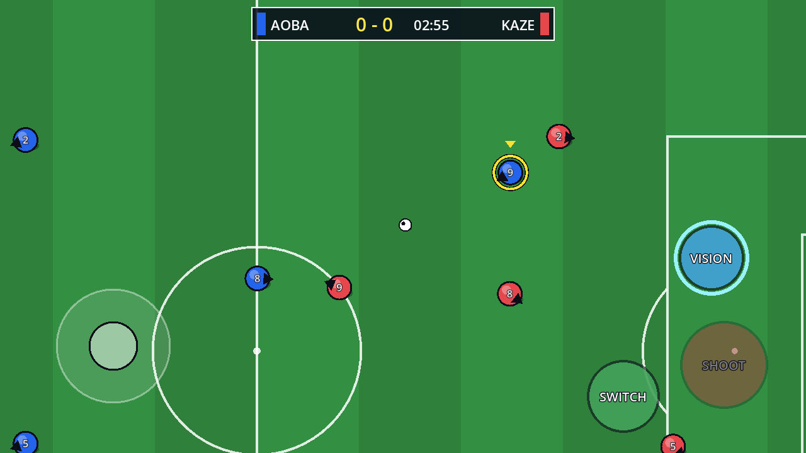

# Ao Soccer — نموذج أولي (Godot 4)

لعبة كرة قدم للموبايل مستوحاة من **أسلوب** أنمي *Ao Ashi*: كرة قدم تكتيكية تعتمد على
**قراءة الملعب والتمركز** بدل القوى الخارقة. الشخصيات والفرق والأسماء كلها أصلية
(لا نستخدم أي محتوى محمي من العمل الأصلي).

| اللعب | رؤية الملعب (Vision) | الهدف |
|---|---|---|
|  |  |  |

## الميزة الأساسية: رؤية الملعب 👁️
اضغط **VISION**: يتباطأ الوقت، وترتفع الكاميرا لمنظر علوي للملعب كامل، وتظهر كل خطوط التمرير:

- 🟢 **أخضر:** الممر مفتوح.
- 🟡 **أصفر:** الممر خطِر.
- 🔴 **أحمر:** الممر مقطوع.
- **BEST:** أفضل خيار تمرير.

**المسْ أي زميل** لتمرّر له مباشرة. وإذا كانت الكرة مع الخصم، تشوف خيارات تمريره
(**DANGER**) عشان تعرف أي ممر لازم تقطعه. الطاقة تنقص أثناء الاستخدام وتتعبأ مع الوقت.

## التحكم
| الموبايل | الكيبورد | الوظيفة |
|---|---|---|
| جويستك (يسار الشاشة) | WASD / الأسهم | الحركة |
| PASS | Space / J | تمرير (باتجاه الجويستك). بدون كرة يصير **SWITCH** لتبديل اللاعب |
| SHOOT | K / Enter | تسديد (الجويستك فوق/تحت يحدد زاوية المرمى) |
| VISION | L / Shift | رؤية الملعب |

## المحتوى الحالي
- مباراة 5 ضد 5 من منظور علوي، مدتها 3 دقائق.
- فيزياء كرة فيها ارتفاع وهمي: التمريرة تُرفع تلقائياً إذا الممر مقطوع.
- ذكاء اصطناعي للفريقين يشمل:
  - تمركز حسب الخطة يتحرك مع الكرة.
  - ضغط على حامل الكرة.
  - تمرير وتسديد.
  - حارس مرمى يقرأ اتجاه التسديدة.
- افتكاك الكرة، وارتداد الكرة السريعة عن اللاعب.
- تبديل تلقائي للاعب الأقرب.
- أسلوب أنمي:
  - شخصيات بتظليل Cel-shading وحدود حبر.
  - لقطات قطع (Cut-ins) لـ GOAL!! و SHOOT! و VISION مع خطوط سرعة.
  - اهتزاز كاميرا.

## التشغيل
1. نزّل [Godot 4.4+](https://godotengine.org/download).
2. افتح `project.godot` واضغط ▶️ (F5). الماوس يحاكي اللمس على الكمبيوتر.

### على الجوال (أندرويد)
`Project → Install Android Build Template` ثم `Project → Export → Android`
(يحتاج Android SDK و JDK 17 حسب [دليل Godot](https://docs.godotengine.org/en/stable/tutorials/export/exporting_for_android.html)).

### اختبار المحاكاة
```bash
godot --headless --path . --fixed-fps 60 -s tests/sim_test.gd
```
يلعب مباراة كاملة بمدخلات عشوائية، ويتأكد من مسار المباراة كله: البداية، والأهداف، ونهاية المباراة، وإعادة التشغيل.

## هيكل المشروع
```
scenes/main.tscn          المشهد الرئيسي (يبني كل شيء بالكود)
scripts/soccer_match.gd   سير المباراة + الذكاء الاصطناعي + التمرير والتسديد
scripts/footballer.gd     اللاعب (الحركة والرسم)
scripts/ball.gd           فيزياء الكرة واكتشاف الأهداف
scripts/field_vision.gd   ميزة رؤية الملعب
scripts/touch_controls.gd تحكم اللمس المتعدد
scripts/hud.gd            لوحة النتيجة ولقطات القطع
scripts/pitch.gd          رسم الملعب
scripts/config.gd         ثوابت الضبط
tests/sim_test.gd         اختبار محاكاة headless
```

## الخطوات القادمة المقترحة
- [ ] رسومات شخصيات أنمي (Sprites) بدل الدوائر، مع أنيميشن جري وتسديد.
- [ ] تمريرة بينية (Through ball)، وتسديد بقوة متدرجة (ضغط مطوّل).
- [ ] خروج الكرة من الملعب: رمية تماس، وركنية، وضربة مرمى.
- [ ] تقييم التمركز بدون كرة، وهو جوهر Ao Ashi.
- [ ] وضع القصة: أكاديمية الشباب، والتحول من مهاجم إلى ظهير.
- [ ] أصوات وموسيقى، وواجهة عربية بخط يدعم العربي.
